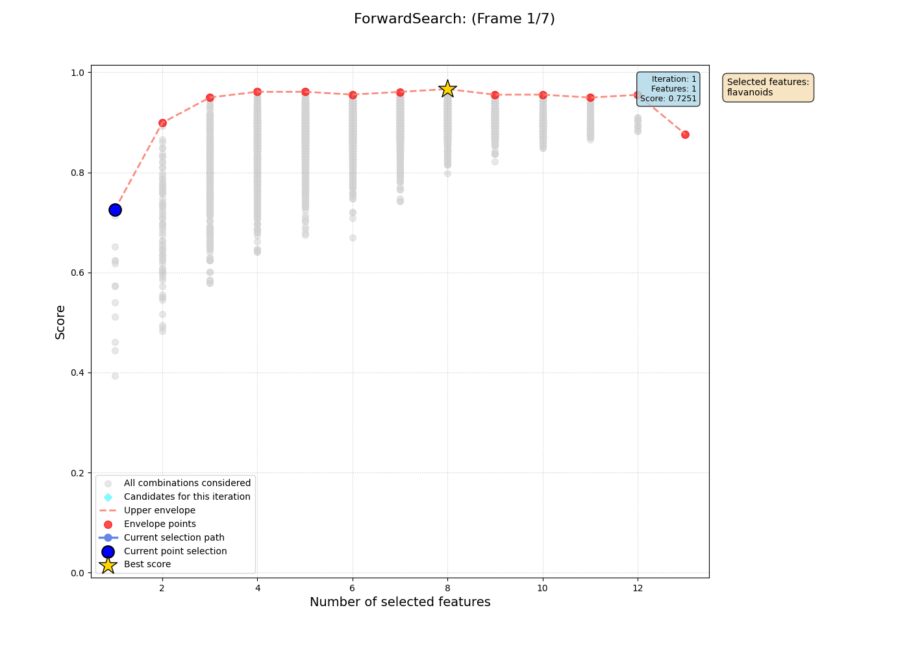
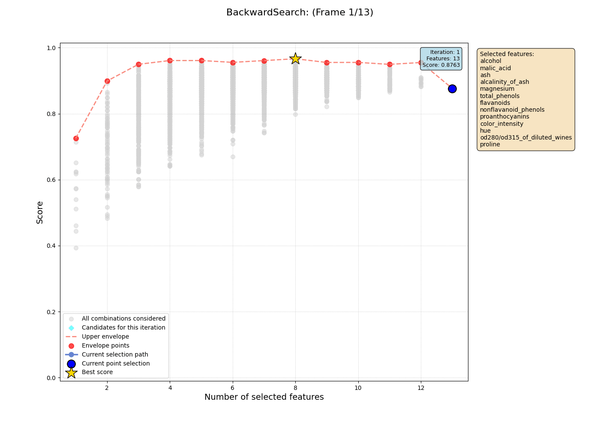
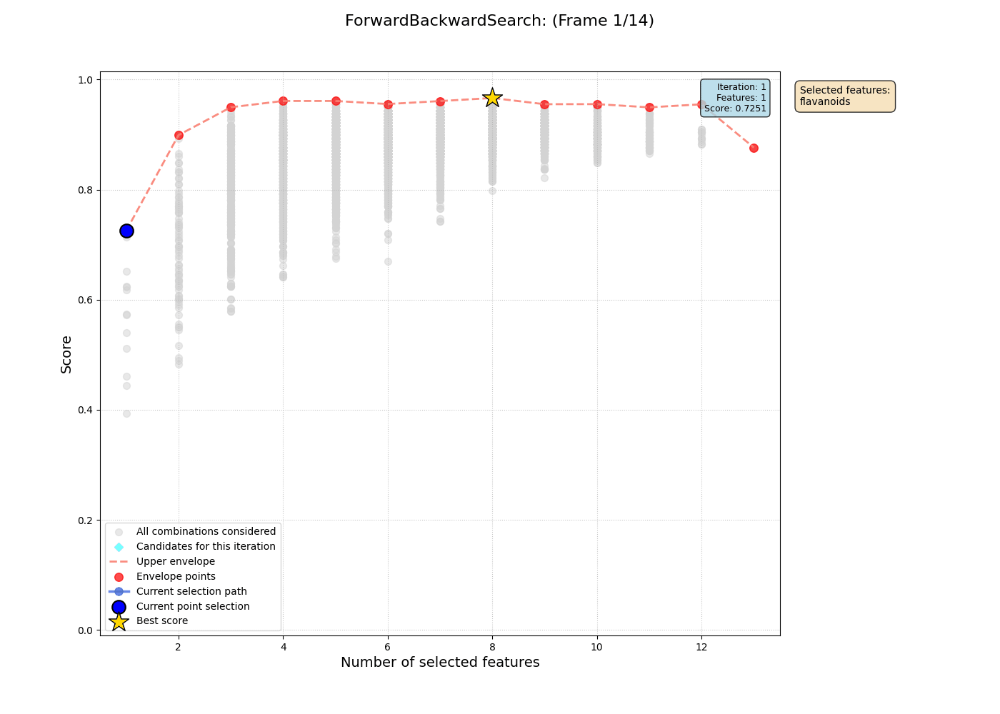
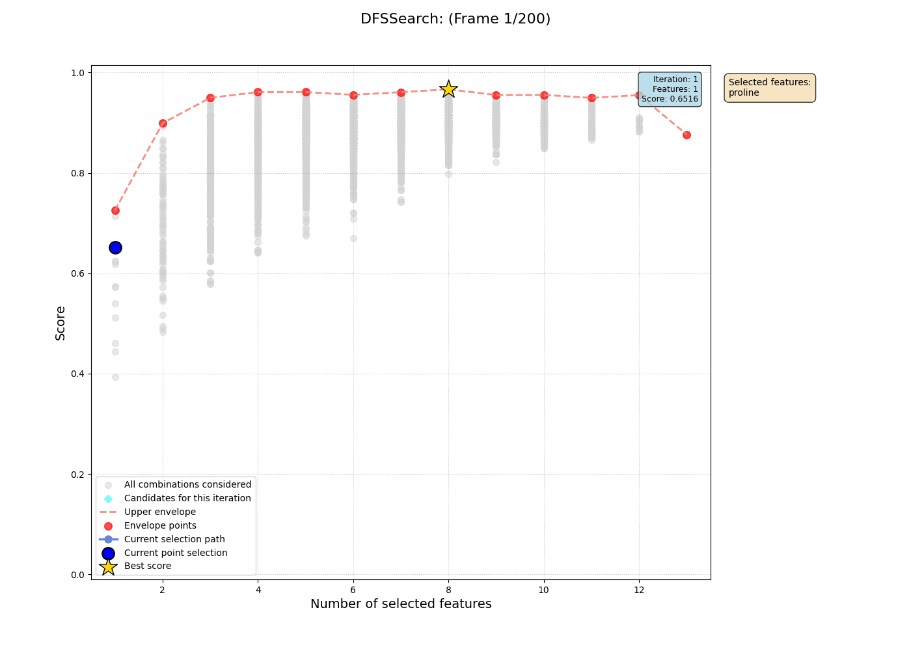
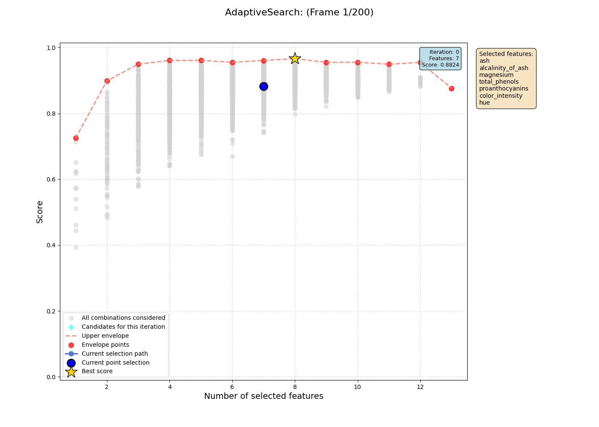
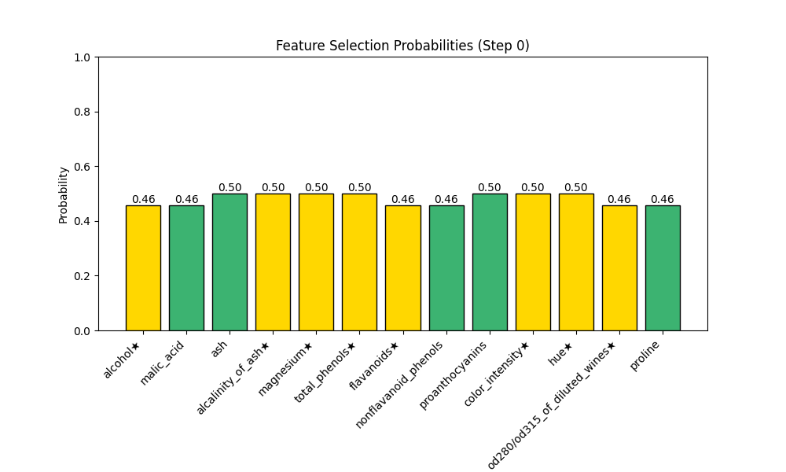
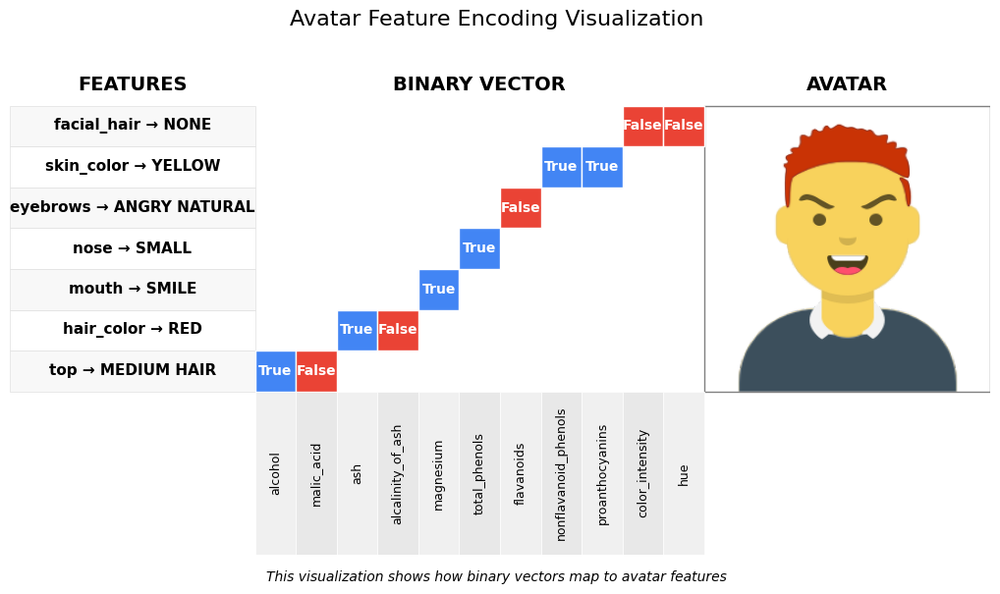
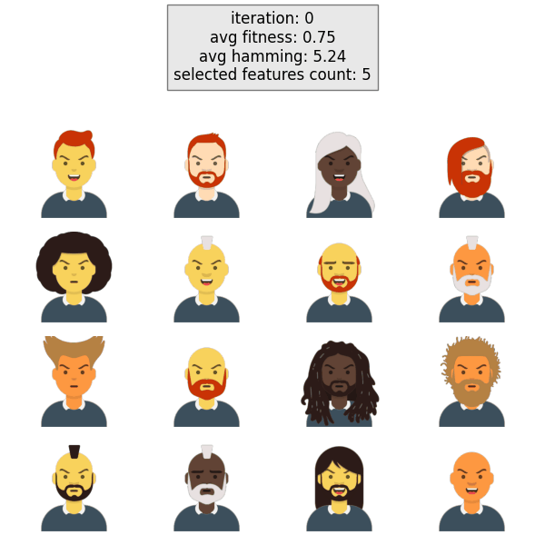

# A Showcase of Feature Selection Algorithms in Python

This repository contains Python implementations of various feature selection algorithms, designed to demonstrate, visualize, and compare their behavior. The code is written with a scikit-learn-compatible API to make it easy to use and understand.

The primary goal is not to provide a production-ready library, but to serve as an educational resource and a collection of clear, working examples of different search strategies for feature selection.

## What's Included?

- **Algorithm Implementations**: Clear, object-oriented implementations of various search algorithms.
- **Scikit-learn Compatibility**: A familiar `fit`/`transform` interface that works with sklearn estimators and cross-validation tools.
- **Insightful Visualizations**: Tools to animate the search progress, compare algorithms against an optimal solution, and visualize the inner workings of methods like Genetic Algorithms and Adaptive Search.
- **Jupyter Notebooks**: Example notebooks that walk through the usage of each algorithm and generate the visualizations.

## Quick Start Example

All implemented selectors follow a consistent API, inspired by scikit-learn, to make them easy to use and compare. Here's a quick example of how to use one.

```python
from sklearn.datasets import load_wine
from sklearn.tree import DecisionTreeClassifier
from sklearn.model_selection import KFold
from feature_selection.core.stepwise_selection import ForwardFeatureSelector

# 1. Prepare your data and estimator
dataset = load_wine()
X = dataset.data
y = dataset.target
estimator = DecisionTreeClassifier(random_state=42)
cv = KFold(n_splits=5, shuffle=True, random_state=42)

# 2. Initialize a feature selector
forward_search = ForwardFeatureSelector(
    estimator=estimator,
    scoring='accuracy',
    cv=cv
)

# 3. Run the selection process
forward_search.fit(X, y)

# 4. Check the results
print(f"Selected Features: {forward_search.selected_features.features}")
print(f"Best Score: {forward_search.selected_features.score}")

# 5. Get the transformed dataset
X_transformed = forward_search.transform(X)
```

## Algorithm Demonstrations

Here are the implemented algorithms demonstrated on the Wine dataset. The visualizations plot the score of a feature subset against its size. The gray area represents the "envelope" of all possible solutions found by an exhaustive `FullSearch`, serving as a baseline for what is optimally achievable.

### 1. Full Search

This method performs an exhaustive search over all possible feature combinations. It is guaranteed to find the optimal feature subset but is computationally expensive and only feasible for a small number of features. It's used here to establish a ground truth for comparison.

```python
from feature_selection.core import FullSearch

full_search = FullSearch(
    estimator=estimator,
    scoring='accuracy',
    cv=cv
)
full_search.fit(X, y)

# Best found subset
# full_search.selected_features
# FeatureSet(features={0, 3, 4, 5, 6, 9, 10, 11}, score=0.9663...)
```

### 2. Forward Selection

A greedy algorithm that starts with no features and iteratively adds the one that provides the highest score.



### 3. Backward Selection

Starts with all features and iteratively removes the one that causes the smallest drop in performance.



### 4. Forward-Backward (Stepwise) Selection

A bidirectional search that considers both adding and removing features at each step.



### 5. Beam Search

An optimization of breadth-first search that keeps a limited number (`beam_width`) of the best candidates at each step of expansion.


### 6. Depth-First Search (DFS)

Explores the feature space by going as deep as possible along each branch of the search tree.



### 7. Adaptive Monte Carlo Search

A randomized search that intelligently updates a probability distribution over the features, learning to sample more promising subsets over time.



This method allows for a unique visualization of how the inclusion probabilities for each feature evolve. Features belonging to the optimal set (found by `FullSearch`) are highlighted in yellow.



### 8. Genetic Algorithm

A meta-heuristic inspired by natural selection. A population of candidate feature sets evolves through selection, crossover, and mutation to find high-performing solutions.

The evolution of the population is visualized as a grid of "avatars," where each avatar represents a feature subset.




## Common Design (`BaseFeatureSelector`)

To ensure consistency across the examples, all selectors inherit from a common `BaseFeatureSelector` abstract class. It standardizes the key components:

- `estimator`: The ML model used for evaluation (e.g., `DecisionTreeClassifier`).
- `scoring`: The performance metric (e.g., `'accuracy'`).
- `cv`: The cross-validation strategy.
- `fit(X, y)`: The method that runs the selection algorithm.
- `transform(X)`: A method to reduce the dataset to the selected features.
- `history`: A record of the search process, used for visualizations.

## Project Structure

The project is organized into logical modules for clarity and maintainability.

```
.
├── assets/                    # Contains all generated GIFs and images
├── feature_selection/
│   ├── core/                  # Core algorithm implementations
│   │   ├── base.py            # The abstract base class
│   │   ├── ...                # Other algorithm files
│   ├── schemas/               # Data structures (e.g., History)
│   └── visualization/         # Code for generating plots and animations
├── notebooks/                 # Jupyter notebooks with examples
├── tests/                     # Unit tests
├── pyproject.toml             # Project metadata and dependencies
└── README.md                  # This file
```